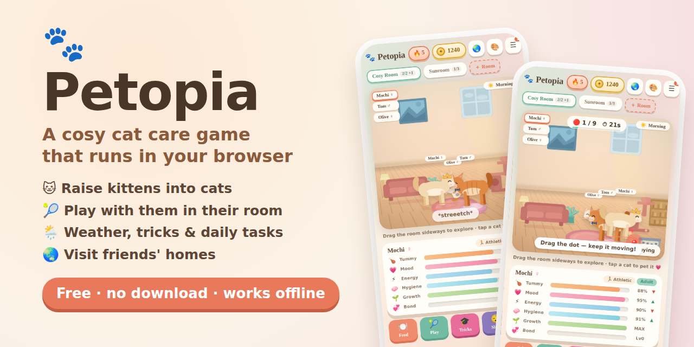
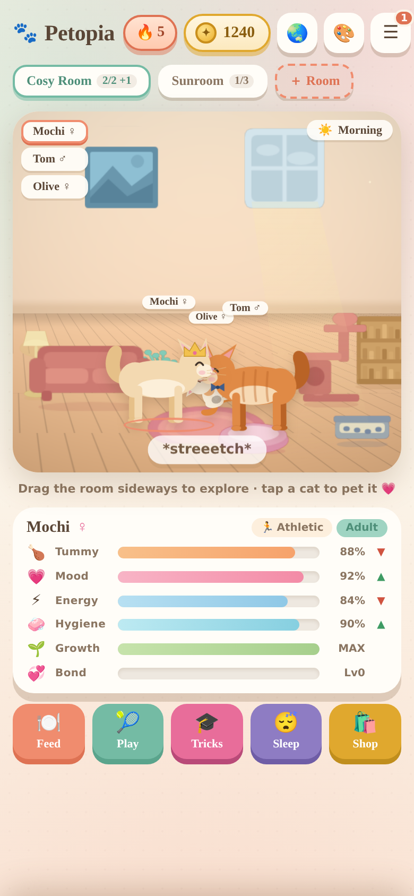
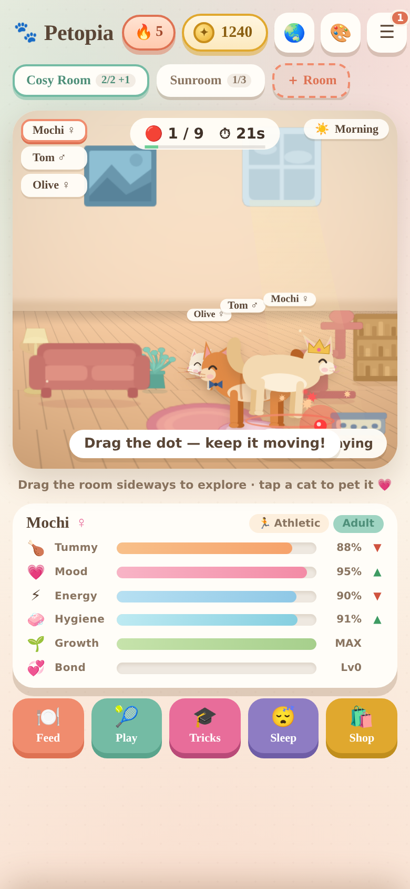
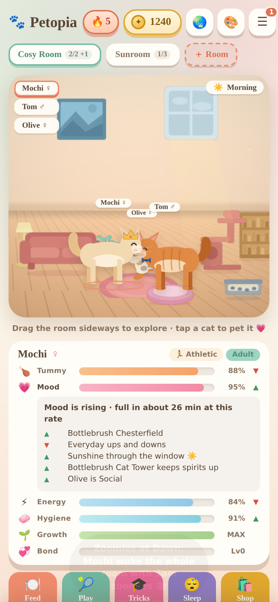
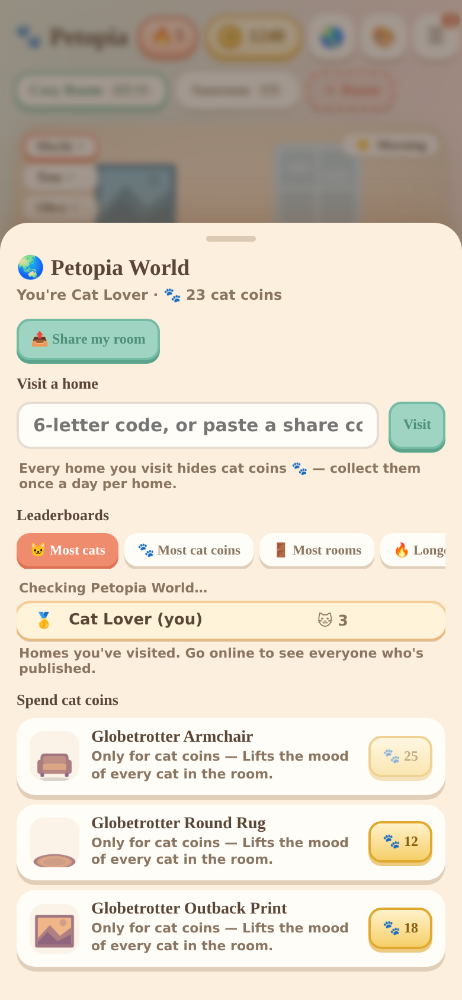

# Petopia 🐾 a cosy cat care game in your browser



**A free virtual pet game about cats.** Raise kittens into cats, keep them fed, clean and happy, decorate their rooms, teach them tricks, play with them, and share your home with friends in Petopia World. Think Tamagotchi meets a cosy cat café, with Aussie seasons.

**▶ [Play in your browser](https://catancats.github.io/Petopia/)** · **⬇ [Download](https://github.com/CatanCats/Petopia/archive/refs/heads/main.zip)** · no install, no account, works offline: it's one HTML file.

<p align="center">
  
  
  
  
</p>

---

## Play it

**Online:** [catancats.github.io/Petopia](https://catancats.github.io/Petopia/). This needs GitHub Pages switched on; see [Getting found](#getting-found).

**Offline:**
1. On GitHub, press **Code → Download ZIP** and unzip it.
2. Open **`Petopia.html`** (or `index.html` for the welcome page) in any modern browser: Chrome, Edge, Firefox or Safari, on a computer or phone.

`petopia/` is a self-contained copy of the same game with its music. Send someone that folder on its own and they can play from `petopia/petopia.html`.

**Your save** lives in the browser you play in, so a different browser or device starts a new home. Settings → **Start a brand new home** wipes it. If a new version doesn't seem to change anything, press **Ctrl+Shift+R** (Cmd+Shift+R on a Mac) so the browser drops its cached copy.

---

## Your cats

Every cat has four **needs**, plus **growth** and **bond**:

| Bar | Goes down when… | Goes up when… |
|---|---|---|
| 🍗 Tummy | time passes (slower while asleep) | you feed them |
| 💗 Mood | time passes; faster if they're hungry, tired, grubby, the room's messy, or it's dark at night | pats, games, tricks, mood furniture, sunshine |
| ⚡ Energy | they're awake (faster at night or when starving) | they sleep, especially in a bed |
| 🧼 Hygiene | the floor or litter tray is dirty | the room is kept clean |
| 🌱 Growth | — | eating, toys, winning games (not while sick) |
| 💞 Bond | — | pats, tricks, toys, games, and slowly on its own when all four needs are high |

**Tap any bar to see why it's moving.** The panel lists every reason by name ("Dirty litter tray", "Dark room at night", "Pippin is Social", "Honey Oak Armchair"), how long until the bar is full or empty at the current rate, and a tip for the biggest problem. It uses exactly the same maths as the game itself, so it's always right.

**Life stages:** kitten → teen → adult. Growth fills the bar, and a sick cat doesn't grow until it's better.

**Neglect:** if needs stay very low a cat gets sick, then weak. With *away mode* on (the default), a badly neglected cat wanders off instead of passing away, and you bring it home by playing the **Homeward Maze**. Tap the purple banner, then swipe: the paw runs along corridors and stops at each junction.

### Traits

Every cat has one trait. Kittens usually inherit one from a parent.

| Trait | What it does |
|---|---|
| 🐾 Easy-going | No quirks. |
| 🪵 Scratchy | Scratches more; wears the sofa down faster without a post. |
| 🙄 Picky | May bring cheap food (kibble, treats) straight back up. |
| 😇 Helpful | Earns coins while you're away. |
| 😼 Naughty | Plays rough and knocks things over. |
| 🙀 Accident-prone | Misses the tray more often. |
| 😪 Sleepy-head | Naps more, and wakes up in a great mood. |
| 🫂 Social | Boosts the mood of everyone in the room. |
| 🫣 Shy | Warms up to pats more slowly. |
| 🍗 Greedy Guts | Empties the auto-feeder, but grows faster. |
| 🏃 Athletic | ×1.4 game payouts, faster in Laser Dash, leaps higher in Feather Chase. |
| 💅 Vain | Stays cleaner, and loves wearing a costume. |

There are 14 breeds to collect, from Cream Puff to Chocolate Mink.

---

## Caring for them

- **Feed:** eight foods, from cheap kibble to a Royal Feast, plus Kitty Medicine for sickness. A fish brought home from **Rockpool Fishing** waits in the pantry as a free meal.
- **Pat:** tap a cat to select it, then tap its head, chin, tummy or paws. Now and then a cat rolls over: catch the **tummy rub** within a few seconds for a big combo.
- **Sleep:** tired cats nap on their own; the Sleep button sends the selected cat off now. A bed makes naps far more restful.
- **Clean:** tap messes on the floor, and tap a litter tray to scoop it. Every grown cat wants its own tray.

### Furniture

There are 56 kinds of furniture in 21 colourways. Place them in **decorate mode** (🎨): drag to move, and use Grid to snap. Many pieces also *do* something, and the stat panel names the piece that's helping:

| Effect | Pieces (examples) |
|---|---|
| Lifts mood | sofas, armchairs, rugs, plants, art, record player, fish tank |
| Better naps | cat beds (best), beanbags, cushions |
| Tops energy up | cat hammock |
| Mood drains slower | cat tower |
| Tummy empties slower | water fountain |
| Birdwatching | window perch |
| Cats play with it on their own | cardboard box, play tunnel, toy basket, yarn ball |
| Scratch here, not the sofa | scratching posts and ramps |
| Toilet | litter trays |
| Feeds hungry cats | auto-feeder (tap it to fill) |
| Lights the room at night | lamps |

**Rooms** hold a set number of residents: Cosy Room 2, Small 3, Medium 5, Large 7, Grand Hall 10. Cats wander between rooms, and a visitor shows as "+1" on the room tab. There are 8 **room styles** (wallpaper, floor, light and music together), 22 wallpapers and 16 floors.

---

## 🎓 Tricks

Every trick has a job, and rests for a while after you use it. To teach one, build your bond, then **win that trick's game together**.

| Trick | Bond | Learnt from | Job | Rests |
|---|---|---|---|---|
| 🪑 Sit | 20 | Feather Chase | On best behaviour for 15 min: no sofa scratching, knocking things over or missing the tray | 10 min |
| 🖐️ High Five | 40 | Rockpool Fishing | +15 energy over 10 min, and the next game is easier | 20 min |
| 🔄 Roll Over | 60 | Yarn Maze | Rolls over for a tummy rub, right now | 30 min |
| 🗣️ Speak | 80 | Laser Dash | Tells you which cat in the whole house needs you most, and why | 5 min |
| 💃 Dance | 100 | Purr Rhythm | Lifts every cat in the room for 20 min, and they all become closer friends | 60 min |

---

## 🎾 Play

**Play** opens a panel about the selected cat. At the top is what it wants right now and why: a trick it's ready to learn, a calm game when it's tired, fishing when it's hungry, the laser for a Naughty cat. Each game rests after a win, but you can retry a loss straight away.

**In the room, with your real cat:**

| Game | How | Special reward |
|---|---|---|
| 🔴 Laser Dash | Drag the dot across the floor; your cat chases, crouches and pounces. Keep it moving: a pounce only counts after you've moved the dot on. | Tuckered out: on best behaviour for 10 min |
| 🪶 Feather Chase | The feather swings overhead; tap to leap as it swoops past. | Extra bond |

**Outings, on their own screen:**

| Game | How | Special reward |
|---|---|---|
| 🐟 Rockpool Fishing | Stop the marker in the blue | A fish for a free meal (two if it's raining; closed in a storm) |
| 🧶 Yarn Maze | Steer the yarn through the gaps | A big growth boost |
| 🎵 Purr Rhythm | Tap notes as they reach the line | Restores energy, so tired cats can still play |

Toys from the shop can be used from the same panel.

---

## 📋 Daily tasks and streaks

Three tasks each morning, picked from what's actually going on in your home: *Teach Mochi Sit*, *Light up the Cosy Room*, *Find a meal Biscuit keeps down*, *A tray for every cat*. Each has a **Go** button that takes you straight to the fix. Caring for a cat once a day keeps your 🔥 streak going.

## 🌦️ Weather

The weather follows Australian seasons, with summer storms and the odd snowy winter day, and changes every three hours. Watch it through your windows, and tap the time chip for a forecast. Settings can switch it off.

| Weather | Effect |
|---|---|
| ☀️ Sunny | A sunbeam through the window lifts mood |
| ⛅ Cloudy | Nothing special |
| 🌧️ Rain | Sleepy cats; cosy with a lamp on, gloomy without |
| ⛈️ Thunderstorm | Scary, unless there's a bed or tunnel to hide in; lightning makes cats jump |
| ❄️ Snow | Chilly; cats sharing a room snuggle up |

## 💞 Breeding

Two grown, well-fed, well-rested cats with enough bond can have a kitten (Shop → Breed). The pair meet at the bed, sit face to face and stay together for the hour: first getting acquainted, then snuggled up. The kitten arrives between them. Tap either cat to see how it's going.

## 🏆 Achievements, coins and the shop

There are 30 achievements. **Coins** come from care, games and tasks, with a gentle hourly cap. **Cat coins 🐾** only come from visiting other players' homes (see below).

---

## 🌏 Petopia World: share, visit, compete

Open it with the 🌏 button at the top.

### Your name comes first

Before you share anything, you pick a name for other players to see, like *cat lover*. It has to be 2–20 letters, numbers or spaces, and hateful words are blocked. **Don't use your real name. Your name is public.**

### Share a room with a friend

🌏 → **Share my room** → choose a room → **Copy code** (or **Send**). Your friend opens 🌏 → **Visit a home** and pastes it. The code can sit inside a message; the game finds it.

The code *is* the room (compressed), so it works with no server, but it's too long to type. It's a snapshot, so share again after you redecorate.

> **Anyone with your code can see that room:** its furniture, the cats who live there, their names, and your player name.

### Publish to Petopia World (public)

**Publish on GitHub** gets you a **6-letter code** anyone can type, like `KTZ4QA`, and a place on the public leaderboards.

1. The game opens a pre-filled GitHub issue. You need a free GitHub account.
2. Press **Submit** without changing the text.
3. Within a minute or two the Petopia robot replies with your code, and closes the issue.
4. Type the code into 🌏 → Share → *Got your code?* so the game remembers it.

New homes take up to about 5 minutes to appear for everyone. **Publish again** to update your home; you keep the same code. To take your homes down, open an issue titled **`[world-remove]`**. Each GitHub account can publish up to 3 homes.

> **Published homes are public.** Anyone can visit them, and they're listed on the leaderboards.

### Visiting and cat coins

Visiting shows the other player's room with their cats wandering about. You can pet them, but nothing you do changes their home. Your own home waits, paused, until you press **Go home**.

Every home hides **3–7 cat coins 🐾** (more if they have more cats). Tap them to collect. You can collect in each home once a day. Spend cat coins on **Globetrotter** furniture, which can't be bought any other way.

### Leaderboards

Four boards: 🐱 **most cats**, 🐾 **most cat coins** collected, 🚪 **most rooms** and 🔥 **longest streak**. They include everyone who's published, plus you, plus any home you've visited by code. Offline, the game shows the last copy it saw. Numbers are what each player's game reports, so this is for fun, not a contest with prizes.

### How it works (for the curious)

- Published homes are plain files in this repo: `world/index.json` (the leaderboard) and `world/rooms/<CODE>.json` (one per home). Every copy of the game reads them from GitHub.
- Players can't write to the repo directly, since that would need a secret key anyone could copy out of the game. Instead, **Publish** opens an issue, and **`.github/workflows/petopia-world.yml`** runs **`world/tools/publish.mjs`**. The script checks the code field by field, makes sure only the account that first published a home can update it, writes the files, and replies.
- The game checks everything that arrives from a code or from GitHub (`cleanHome()` in `Petopia.html`) before using it.

### Looking after Petopia World (repo owner)

- **Actions must be allowed:** Settings → Actions → General → allow actions, and set **Workflow permissions** to *Read and write*. If `main` is protected against direct pushes, the robot can't save homes: allow GitHub Actions to push, or drop the protection.
- **Removing a home:** delete its entry from `world/index.json` and its `world/rooms/<CODE>.json`, then commit.
- **Blocked words** live in two places that should match: `NAME_BLOCK` in `Petopia.html` and in `world/tools/publish.mjs`.
- **Forks:** change `WORLD_REPO` near the top of the Petopia World section in `Petopia.html` to your own `owner/repo`.

---

## Files

| Path | What it is |
|---|---|
| `index.html` | The welcome page: what Petopia is, screenshots, and a Play button |
| `Petopia.html` | The game: one file, all code and art inside |
| `petopia/petopia.html` | The same game, for the self-contained folder (only its songs path differs) |
| `petopia/Songs/` | Background music |
| `petopia/IDEAS.md` | Design notes on mini-games |
| `world/` | Petopia World data, plus the robot's script in `world/tools/` |
| `.github/workflows/petopia-world.yml` | The robot that files published homes |
| `media/` | Screenshots and the link-preview image (`social-preview.png`) |
| `sitemap.xml`, `robots.txt` | Help search engines find the online version |
| `Old Versions/` | Earlier versions, kept for reference |

**Changing the game:** edit `Petopia.html`, then refresh the folder copy so the two stay identical apart from the songs path:

```sh
sed 's#^const SONGS_DIR="petopia/Songs/";#const SONGS_DIR="Songs/";#' Petopia.html > petopia/petopia.html
```

The code is split into numbered sections (search for `═══`). Stats are driven by `catRates()`, which both the game tick and the stat panel use.

## Getting found

Some of this only the repo owner can do on GitHub:

1. **Description and topics:** on the repo's front page, the ⚙️ next to **About**.
2. **Website:** turn on **Settings → Pages → Deploy from a branch → `main` / root**. The game is then playable at `catancats.github.io/Petopia`, and `index.html` is its front page. Put that link in **About → Website**.
3. **Social preview:** **Settings → General → Social preview**, then upload `media/social-preview.png`. It's the picture shown when the repo link is shared.

Already in the files: link previews (title, description and image) in `index.html` and `Petopia.html`, a page icon, a sitemap and `robots.txt`.

## Licence

The game's code, art and design are under **CC BY-NC-SA 4.0**; see [`LICENSE`](LICENSE). The music was generated with Suno and follows Suno's terms; `LICENSE` has the details.

---

## Ideas for what's next

**Bigger features**
- **More kinds of pets.** The name promises a household of pets. The renderer recolours one drawing into many colours, and pets already grow through life stages, so a bunny or puppy would reuse a lot.
- **Visitors to your home.** Neighbours (NPCs) who drop by, have favourite cats and leave tips, with happier, cleaner cats earning more. That would give every care stat a reason to matter at once.
- **A scrapbook per cat:** photo mode plus automatic moments (first trick, first friend, growing up, their kittens).

**Petopia World**
- **Leave a gift when you visit:** a treat that shows up in the other player's home next time they share. It needs the server side to carry it.
- **Themed weekly contests**, like "best Halloween room", voted by visitors.
- **Guest book:** visitors pick from friendly preset messages (no free text, so it stays safe for kids).
- **Show visits:** "12 people visited your home this week".

**Depth**
- **Real save upgrades instead of wipes:** a proper step-by-step upgrade using the save's version number, so future changes never need a fresh start.
- **Save backup:** export and import your save as a file.
- **Offline progress that uses the same maths** (`catRates`) as live play. Right now furniture doesn't help while you're away.
- **Visible friendships:** friends nap together and groom each other, and rivals squabble.
- **A family tree** for kittens, with markings passed down that you can see.

**Polish**
- **A guided first five minutes** for new players: feed, pet, clean, decorate.
- **Accessibility:** bigger-text and reduced-motion settings; keyboard play for the mini-games.
- **Automated tests:** the browser test scripts used during development could live in the repo and run on every change.
